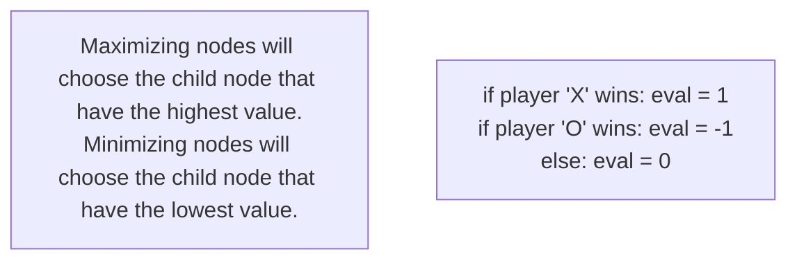
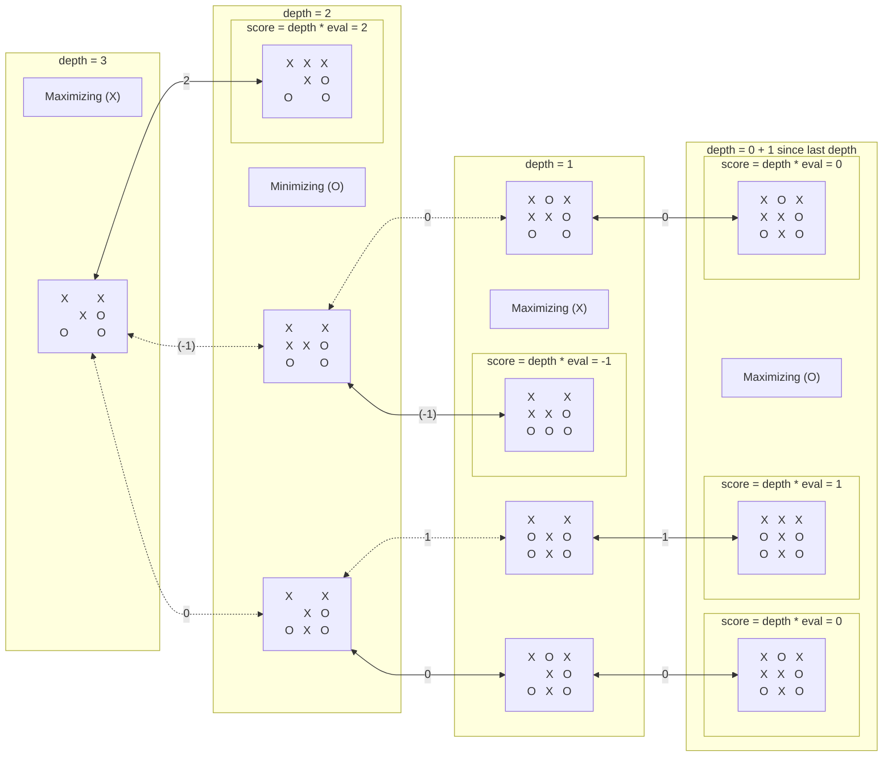
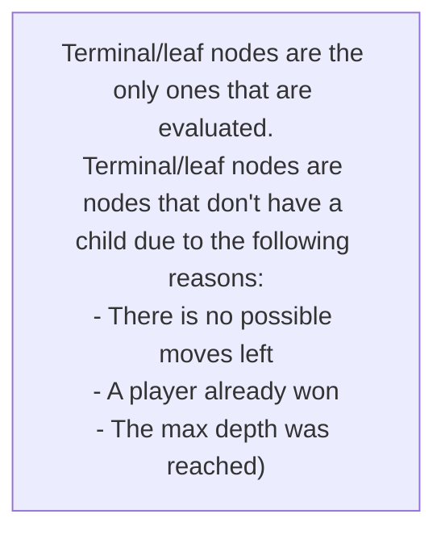

# **MiniMax Tic-Tac-Toe**


A simple project demonstrating my **naive** implementation of the [**minimax**](https://en.wikipedia.org/wiki/Minimax#Pseudocode) algorithm for a tic-tac-toe board with dimensions N x N. It includes a straightforward web application game of tic-tac-toe, allowing you to observe the minimax algorithm in action.

### Test it over the internet :

If you have an internet connection, you can try out my Tic-Tac-Toe web application that showcases my implementation of the minimax-tic-tac-toe algorithm. Here are the links where you can access and test it.

- [Click here to view the DEMO](https://minimax-tic-tac-toe-demo.vercel.app/)
- **Demo raw link** - https://minimax-tic-tac-toe-demo.vercel.app/

### Run it locally :

You can also run the aforementioned Tic-Tac-Toe web application locally on your device. To do so, you will need to have Git and Node installed as prerequisites. Once you have them installed, simply enter the following commands in your terminal:

```shell
git clone https://github.com/mrdcvlsc/minimax-tic-tac-toe.git
cd minimax-tic-tac-toe
npm install
node dev
```

Then open `localhost:3000` in your browser.

### Example search tree of the minimax algorithm

The minimax algorithm is a backtraking (DFS) searching algorithm. It determines the best move by recursively evaluating possible moves. The three important functions are:

1. **minimax**: Recursively evaluates game states by alternating between maximizing and minimizing players. Returns the best score found at each level.

2. **evaluation**: Assigns a numerical score to a game state based on factors like material advantage and positioning. Guides the algorithm towards favorable positions.

3. **moveGeneration**: Generates all possible legal moves from a given game state, allowing exploration of different possibilities.

The algorithm guarantees an optimal solution, assuming both players play optimally. However, it can be computationally expensive in large state spaces, leading to more efficient algorithms like alpha-beta pruning and/or adding depth limitations to the recursive minimax function.






